# 🧠 Intelligent RAG Web Application

[](https://render.com/deploy)
[](https://python.org)
[](https://reactjs.org)
[](https://fastapi.tiangolo.com)
[](LICENSE)

> **A production-grade Retrieval-Augmented Generation (RAG) system** that delivers high-accuracy semantic search without the cost of external LLMs. Built for speed, privacy, and zero-cost deployment.

---

## 🏗️ System Architecture

The application follows a monolithic architecture designed for free-tier deployments (e.g., Render) while maintaining high performance.

```mermaid
graph TD
    User[👤 User] -->|HTTP/HTTPS| Frontend[⚛️ React Frontend]
    Frontend -->|JSON API| Backend[🚀 FastAPI Server]
    
    subgraph "Core RAG Engine"
        Backend -->|Query| Search[🔍 Search Engine]
        Search -->|Vector Search| FAISS[📚 FAISS Index]
        Search -->|Metadata| DB[(🗄️ SQLite/JSON)]
        Search -->|Embeddings| Model[🤖 Sentence-Transformers]
    end
    
    DB -.->|Load Data| FAISS
```



### Key Components

1.  **React Frontend**: A modern, responsive chat interface bundled with Vite. served statically by FastAPI to ensure a single deployable unit.
2.  **FastAPI Backend**: High-performance asynchronous API handling requests, static file serving, and the RAG pipeline.
3.  **Vector Store (FAISS)**: Industry-standard library for efficient similarity search and clustering of dense vectors.
4.  **Embedding Model**: Uses `all-MiniLM-L6-v2` locally to convert text into 384-dimensional vectors, ensuring data privacy and zero API costs.

---

## ✨ Advanced Capabilities

### 1. 🧠 Contextual Awareness (Memory)
Unlike basic search engines, this system maintains conversational context.
> **User**: "Who is **Sundar Pichai**?"
> **User**: "Where did **he** study?"
> **System**: *Automatically resolves "he" to "Sundar Pichai" and retrieves education details.*

### 2. 🔍 Fuzzy Search & Typo Tolerance
Integrated `thefuzz` logic ensures users find what they need, even with spelling mistakes.
> **Query**: "tell me about **satya nadela**"
> **Result**: *Correctly identifies and retrieves records for **Satya Nadella** (96% match confidence).*

### 3. 📚 Comprehensive & Concept Search
- **"Everything" Mode**: Detecting intents like *"tell me everything"* to aggregate Summary, Education, Career, and Contributions into a single cohesive report.
- **Pure Concept Retrieval**: Delivers direct technical explanations for concepts (e.g., *"Python List Comprehension"*) without unnecessary conversational filler.

### 4. ⚡ Zero-Latency Performance
- **Local Embeddings**: No network round-trips to OpenAI/Cohere.
- **Optimized Index**: FAISS provides millisecond-level retrieval.
- **Cache-Friendly**: Static frontend assets are efficient to serve.

---

## 🚀 Quick Start Guide

### Prerequisites
- Python 3.11+
- Node.js 18+
- Git

### Installation

1.  **Clone the Repository**
    ```bash
    git clone https://github.com/RohitSrivatsa29/rag-app.git
    cd rag-app
    ```

2.  **Backend Setup**
    ```bash
    # Create virtual environment (optional but recommended)
    python -m venv venv
    source venv/bin/activate  # Windows: venv\Scripts\activate
    
    # Install dependencies
    pip install -r requirements.txt
    ```

3.  **Frontend Setup**
    ```bash
    cd frontend
    npm install
    npm run build
    cd ..
    ```

4.  **Launch Application**
    ```bash
    python app.py
    ```
    Access the application at `http://localhost:8000`.

---

## 🛠️ Configuration & Customization

### Adding Knowledge
The system is data-agnostic. Simply place standard JSON files in the `data/` directory.

**Supported JSON Structure:**
```json
[
  {
    "id": "unique-id",
    "name": "Entity Name",
    "summary": "Main description...",
    "education": "University details...",
    "career": "Professional history...",
    "keywords": ["tag1", "tag2"]
  }
]
```
*The system creates/updates the vector index automatically on startup.*

### Deployment (Render Free Tier)
1.  Push this code to GitHub.
2.  Create a **Web Service** on Render.
3.  Use the following settings:
    - **Build Command**: `pip install -r requirements.txt`
    - **Start Command**: `uvicorn app:app --host 0.0.0.0 --port 10000`
    - **Environment Variable**: `PYTHON_VERSION = 3.11.0`

---

## 🤝 Contributing

Contributions are welcome! Please follow these steps:
1.  Fork the repository.
2.  Create a feature branch (`git checkout -b feature/AmazingFeature`).
3.  Commit your changes (`git commit -m 'Add some AmazingFeature'`).
4.  Push to the branch (`git push origin feature/AmazingFeature`).
5.  Open a Pull Request.

## 📄 License

Distributed under the MIT License. See `LICENSE` for more information.

---

**Built with ❤️ by Rohit Srivatsa**
